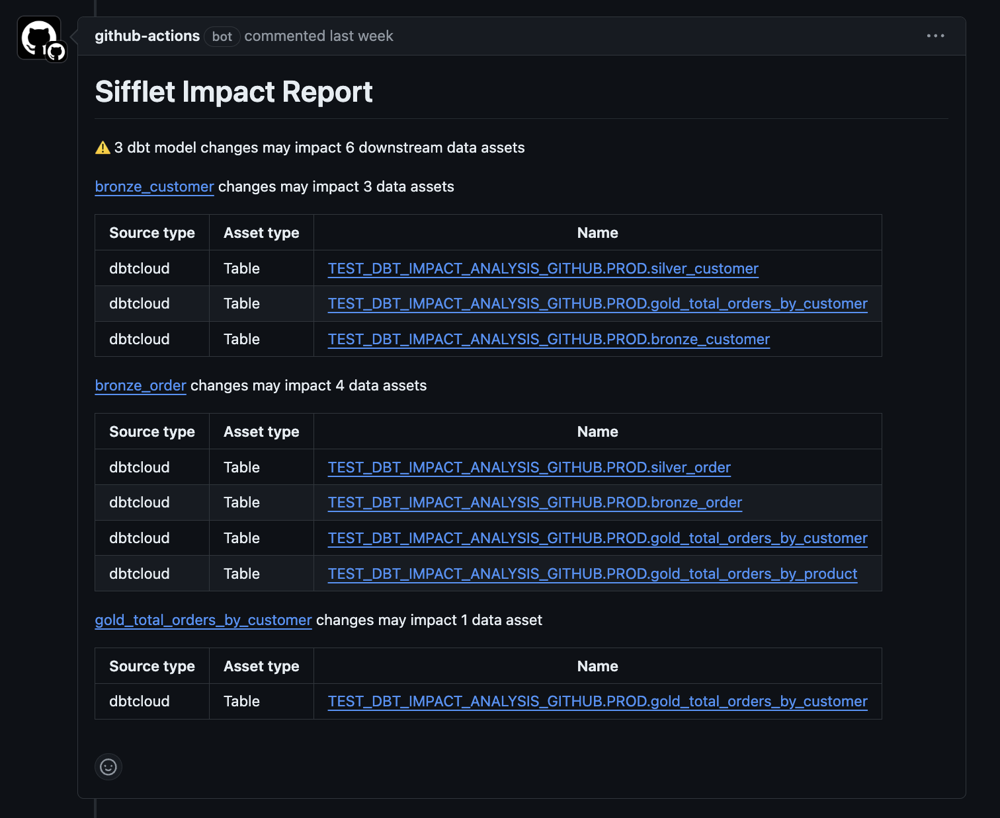

# Sifflet dbt Impact Analysis Action

## Action overview

When you raise a pull request containing changes to one or many dbt models, this action uses Sifflet's lineage API to generate the potential impact of your dbt code changes and posts it as a pull request comment.

The potential impact consists of the list of assets downstream of the dbt model(s) you’re modifying. These assets can be other dbt models, BI dashboards, or any other type of asset that’s cataloged in Sifflet.

## Using the action

To add the action to your repository, you can follow these steps:

1. Generate [a Sifflet API Access Token](https://docs.siffletdata.com/docs/access-tokens) with the “Viewer” role. Once the token is generated, copy its value since it can only be viewed once.
2. Add the token as [a secret to your GitHub repository](https://docs.github.com/en/actions/security-for-github-actions/security-guides/using-secrets-in-github-actions#creating-secrets-for-a-repository). 
If you want to activate the feature in multiple repositories, you can [add the secret to your GitHub organization](https://docs.github.com/en/actions/security-for-github-actions/security-guides/using-secrets-in-github-actions#creating-secrets-for-an-organization).
3. Add the GitHub Action to your repository either using [the GitHub Actions Marketplace](https://docs.github.com/en/actions/writing-workflows/choosing-what-your-workflow-does/using-pre-written-building-blocks-in-your-workflow#adding-an-action-from-github-marketplace) 
or by manually adding the following workflow in a dedicated file ([steps to add a workflow to your GitHub repository](https://docs.github.com/en/actions/writing-workflows/quickstart#creating-your-first-workflow)):

```yaml
on: [pull_request]

jobs:
  dbt_impact_analysis_job:
    runs-on: ubuntu-latest
    name: Impact analysis of dbt changes
    steps:
      - name: dbt impact analysis
        uses: siffletdata/dbt-impact-analysis-action@v1
        with:
          git-provider-token: ${{ secrets.GITHUB_TOKEN }} # You can keep this as-is
          sifflet-instance-url: <THE FULL URL OF YOUR SIFFLET ENVIRONMENT> # This should have the following format: https://<your_instance_name>.siffletdata.com
          sifflet-api-token: ${{ secrets.SIFFLET_API_TOKEN }} # This is the token generated in the first step
          impacted-asset-types: 'DASHBOARD, DATASET' # Optional, comma-separated list of impacted asset types that you want to appear in the impact report
          impacted-tags: 'tag1, tag2' # Optional, list of tags that you want to appear in the impact report (only impacted assets that have a tag from the list will appear in the report)
```

4. Configure the action:
   - `git-provider-token`: You can keep this as-is, it’s a secret created and managed by GitHub.
   - `sifflet-instance-url`: This should be the full URL of your Sifflet environment in the following format: “https://<your_instance_name>.siffletdata.com”.
   - `sifflet-api-token`: This is the token generated in the first step, which you stored as a GitHub secret.
   - `impacted-asset-types`: Optional, comma-separated list of impacted asset types that you want to appear in the impact report. Supported values: ‘DASHBOARD, DATASET’.
     If not provided, all asset types will be included in the impact report.
   - `impacted-tags`: Optional, list of tags that you want to appear in the impact report (only impacted assets that have a tag from the list will appear in the report).
     If not provided, all tags will be included in the impact report.

After performing the above steps, whenever a pull request that modifies SQL files is raised, Sifflet will add a comment containing an impact analysis report.

## Sample comment

The PR comment generated by the action will look as follows:

<p align="center" width="70%">
  
</p>

## Known limitations

- The impact is currently generated at the asset level, so the potentially impacted assets may contain assets that don’t use the field(s) you’re modifying. We plan to transition this feature to field-level lineage in the upcoming months.

- The impact is currently generated based on model file changes, so changes to macros won’t be detected by the feature. We plan to transition to Manifest-based impact generation in the upcoming months.
